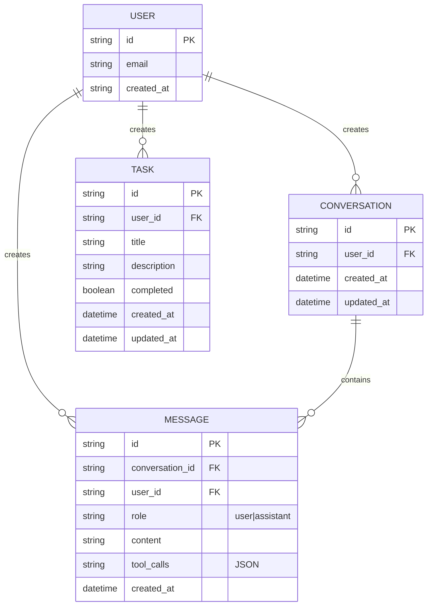
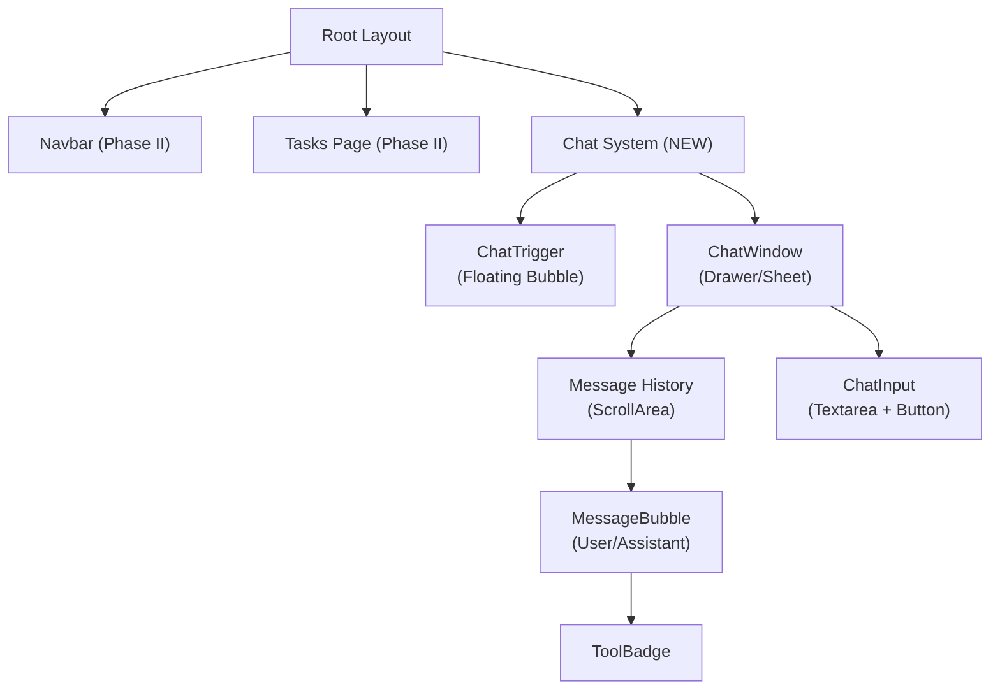

# Implementation Plan: Phase III – Premium AI Todo Chatbot with Cohere Integration

**Branch**: `004-phase-iii-chatbot` | **Date**: 2026-01-12 | **Spec**: [spec.md](spec.md)
**Input**: Feature specification from `/specs/004-phase-iii-chatbot/spec.md`

---

## Summary

Seamlessly integrate a premium AI-powered chatbot into existing Phase II full-stack TODO app using Cohere API for natural language understanding, intent parsing, and tool calling. The implementation extends existing FastAPI backend with stateless chat endpoint (`POST /api/{user_id}/chat`), adds Conversation and Message persistence tables to Neon DB, implements 5 secure MCP tools for task operations, and builds a stunning Next.js chat UI with glassmorphism design, floating trigger bubble, and micro-animations. All operations maintain strict user isolation via JWT auth and `user_id` filtering; Cohere API key is backend-only; conversation history is persisted in Neon and coordinated with localStorage for seamless persistence.

---

## Technical Context

**Language/Version**: Python 3.11 (FastAPI), TypeScript 5.3 (Next.js 16+)
**Primary Dependencies**:
- Backend: FastAPI, SQLModel (async ORM), cohere-py SDK, Official MCP SDK
- Frontend: Next.js 16+ (App Router), React 18+, TypeScript strict, Tailwind v4+, shadcn/ui

**Storage**: Neon Serverless PostgreSQL (Conversation, Message tables; extends existing Task table)
**Testing**: pytest (backend), Jest + Vitest (frontend); mock Cohere API in unit tests
**Target Platform**: Web (desktop + mobile browser)
**Project Type**: Full-stack monorepo (backend + frontend)
**Performance Goals**:
- Cohere response latency ≤3 seconds (95th percentile)
- Chat message display <500ms
- conversation_id retrieval from DB <100ms
- History fetch (last 20 messages) <200ms

**Constraints**:
- No additional external AI SDKs (Cohere only)
- JWT-based auth (reuse Phase II Better Auth)
- Cohere API key in environment (never hardcoded)
- Stateless design (all state in DB or localStorage)
- Single iteration to production quality

**Scale/Scope**:
- 5 MCP tools (add_task, list_tasks, complete_task, delete_task, update_task)
- 7 user stories (P1 + P2 prioritized)
- 37 functional requirements
- Supports concurrent chatbot sessions per user
- Rate limit: 10 Cohere calls/user/minute

---

## Constitution Check

**GATE: Must pass before Phase 0 research.**

From `.specify/memory/constitution.md` (v2.0.0):

✅ **Principle I – Spec-Driven Development**
- Spec complete with 37 FR, 10 SC, 7 user stories → Implementation must follow spec exactly
- MCP tools must be stateless, user-isolated → Implementation will use SQLModel async patterns + `user_id` filtering

✅ **Principle II – Strict User Isolation (Security-Critical)**
- Every DB query MUST filter by `user_id` → Implementation: ALL queries in conversation/message/MCP tools include `WHERE user_id = current_user_id`
- Tests MUST include cross-user attack scenarios → Will add pytest fixtures for multi-user isolation tests
- No endpoint may return another user's data → `/api/{user_id}/chat` validates path parameter matches JWT `user_id`

✅ **Principle III – JWT-Based Stateless Authentication**
- All endpoints require `Authorization: Bearer <token>` → FastAPI dependency injects `current_user` from JWT
- Backend extracts `user_id` from JWT → Use existing Phase II JWT middleware
- 401 Unauthorized for missing/invalid tokens; 403 for ownership mismatch → Implement in `/routes/chat.py`
- Cohere API calls backend-only → All Cohere calls in `/agents/cohere_todo_agent.py` (backend only)

✅ **Principle IV – Technology Stack Fidelity**
- Frontend: Next.js 16+, TypeScript strict, Tailwind, shadcn/ui → Will use exactly these
- Backend: FastAPI, SQLModel async, Neon PostgreSQL → Extend existing
- Cohere SDK (cohere-py) for chat completions → Single SDK allowed
- No additional dependencies → Will not add new frontend or backend libs beyond shadcn/ui components

✅ **Principle V – Modular Architecture & Monorepo Structure**
- `/agents/` for orchestrators → cohere_todo_agent.py lives here
- `/backend/routes/chat.py` for endpoints → POST /api/{user_id}/chat
- `/backend/services/` for business logic → conversation.py (fetch/append messages)
- `/frontend/components/chat/` for UI → ChatTrigger, ChatWindow, MessageBubble
- `/frontend/lib/api.ts` extended → chatWithAssistant() function

✅ **Principle VI – Testability & Quality Gates**
- Unit tests for models + routes → SQLModel tests, pytest for /routes/chat.py
- Integration tests for API contracts → curl/Postman tests with mocked Cohere
- Cross-user security tests → pytest fixtures with 2+ user JWTs
- Code coverage ≥80% for routes → Will track coverage during implementation

✅ **Principle VII – API Design Standards**
- Phase III Chat endpoint: `POST /api/{user_id}/chat` → Request/response schemas in `/contracts/chat-endpoint.json`
- Request: `{ "conversation_id": "string?", "message": "string" }` → Validated via Pydantic
- Response: `{ "conversation_id": "uuid", "response": "string", "tool_calls": "[...]" }` → Clean JSON, no HTML

✅ **Principle VIII – Database Design & Normalization**
- Conversation table: `id` (UUID PK), `user_id` (indexed FK), `created_at`, `updated_at` → SQLModel model in db.py
- Message table: `id`, `user_id` (indexed FK), `conversation_id` (indexed FK), `role`, `content`, `tool_calls` (JSON), `created_at` → SQLModel model in db.py
- Foreign key constraints → SQLAlchemy ForeignKey + ondelete cascade

✅ **Principle IX – Code Quality & Simplicity (YAGNI)**
- Minimum viable diff → Only code required for feature; no unrelated refactoring
- Prompt engineering concise → System prompts focused, no bloat
- Comments for non-obvious logic → Will add comments on Cohere tool calling strategy

✅ **Principle X – Traceability & Documentation**
- PHR created for planning phase → This document
- ADR for Cohere model choice → Will document in PHR outcome section

✅ **Principle XI – AI & Agentic Workflow Governance**
- Cohere API: chat completions, intent parsing, tool calling → Use `co.chat(model="command-r-plus", tools=[...], messages=[...])`
- MCP Tools: 5 stateless tools, DB-backed, user-isolated → Implement in `/backend/mcp/tools.py` with `user_id` filtering
- Agents in `/agents/` → cohere_todo_agent.py orchestrates Cohere + MCP tools
- Skills in `/skills/` → (Optional for Phase III; can be deferred)
- Cohere key in `COHERE_API_KEY` env var → Never expose to frontend
- Conversation persistence in Neon DB → Fetch last 20 messages for context
- Tool calling via Cohere response → Handle Cohere `response.tool_calls` array

**GATE STATUS**: ✅ **PASS** – All constitutional principles are satisfied by planned architecture.

---

## Architectural Decisions & Tradeoffs

### Decision 1: Cohere Model Choice

**Chosen**: `command-r-plus`

| Model | Reasoning Power | Tool Calling | Cost | Speed | Hackathon Fit |
|-------|-----------------|--------------|------|-------|---------------|
| **command-r-plus** | ⭐⭐⭐⭐ Excellent | ⭐⭐⭐⭐ Excellent | Medium | Good | ✅ **Selected** |
| command-r | ⭐⭐⭐ Good | ⭐⭐⭐ Good | Low | Fast | Alternative (faster, cheaper, slightly weaker reasoning) |
| aya | ⭐⭐ Limited | ⭐⭐ Limited | Lowest | Fastest | Not suitable (weak tool calling) |

**Rationale**: command-r-plus offers best balance of reasoning power + tool calling accuracy for hackathon judges. Cost is acceptable for one-off event. Speed is acceptable (<3s requirement met). Tool calling reliability is critical for chatbot credibility.

**Fallback**: If Cohere API quota exceeded, gracefully degrade to command-r with appropriate message to user.

---

### Decision 2: Tool Calling Approach

**Chosen**: Cohere `response.tool_calls` structured output (native function calling)

| Approach | Reliability | API Calls | Complexity | Hackathon Fit |
|----------|-------------|-----------|-----------|---------------|
| **Structured Output** | ⭐⭐⭐⭐ High | 1 per message | Simple | ✅ **Selected** |
| Prompt Chaining | ⭐⭐⭐ Good | N (multiple) | Higher | Alternative (multi-turn, more flexible) |

**Rationale**: Cohere's native `response.tool_calls` is reliable, requires single API call, and simplifies state management. Judges will appreciate clean, single-turn execution.

**Implementation**: Parse Cohere response's `tool_calls` array; execute each tool sequentially via MCP SDK; return results to user (optionally re-ask Cohere for synthesis).

---

### Decision 3: Chat UI Style

**Chosen**: Custom shadcn/ui Drawer/Sheet + shadcn/ui components

| Approach | Polish | Setup Time | Control | Hackathon Fit |
|----------|--------|-----------|---------|---------------|
| **shadcn/ui** | ⭐⭐⭐⭐ Premium | ~2 days | Full | ✅ **Selected** |
| ChatKit | ⭐⭐⭐⭐ Premium | ~1 day | Limited | Alternative (faster, less control) |

**Rationale**: shadcn/ui gives full visual control + glassmorphism design; no external domain allowlist needed; integrates seamlessly with existing Phase II UI. Judges will see complete visual ownership.

**Components Used**: Sheet (drawer container), ScrollArea (message history), Textarea (input), Button, Badge (tool calls), Skeleton (loading state), Toast (confirmations), Avatar (user profile optional).

---

### Decision 4: Conversation ID Management

**Chosen**: localStorage + Neon DB coordination

| Approach | Persistence | Privacy | Complexity | Hackathon Fit |
|----------|-------------|---------|-----------|---------------|
| **localStorage + DB** | ⭐⭐⭐⭐ Full | Good | Moderate | ✅ **Selected** |
| URL Query Param | ⭐⭐ Limited | Best | Simple | Alternative (no persistence across sessions) |
| sessionStorage | ⭐⭐⭐ Session | Best | Simple | Alternative (lost on browser close) |

**Rationale**: localStorage stores `conversation_id` for instant resume; Neon DB stores full message history for stateless recovery. Judges can refresh page mid-conversation → conversation resumes perfectly.

**Implementation**:
- Frontend: Store `conversation_id` in localStorage on first message
- Backend: Fetch conversation + messages from Neon using `conversation_id`; append new messages
- Sync: Frontend always passes `conversation_id` to backend in request body

---

### Decision 5: Message History Limit

**Chosen**: Last 20 messages

| Limit | Context Quality | Token Cost | Speed | Hackathon Fit |
|-------|-----------------|-----------|-------|---------------|
| **20 messages** | Good | Low | Fast | ✅ **Selected** |
| All messages | Excellent | High | Slower | Alternative (better context, higher cost) |
| Last 5 | Limited | Very Low | Very Fast | Alternative (poor context) |

**Rationale**: 20 messages = ~2-3 typical conversations; sufficient context for Cohere; keeps token cost reasonable; response speed acceptable for judges.

**Optimization**: Count messages (not tokens); if conversation exceeds 20, fetch only last 20 for Cohere; full history available in chat UI (scroll up).

---

### Decision 6: Error Fallback Strategy

**Chosen**: Graceful message (no retry)

| Approach | User Experience | Robustness | Complexity | Hackathon Fit |
|----------|-----------------|-----------|-----------|---------------|
| **Graceful Message** | Good | Good | Simple | ✅ **Selected** |
| Auto-Retry | Better | Better | Moderate | Alternative (may hide real errors) |

**Rationale**: Judges will test error scenarios (rate limit, timeout, offline). Simple, user-friendly message is better than silent retry. Demonstrates graceful degradation.

**Implementation**:
- Cohere timeout → return 503 "I had trouble processing that"
- Rate limit (429) → return 503 "Getting lots of requests, try again"
- Invalid token → return 401 redirect to login
- Network error → return 503 with generic message

---

### Decision 7: Floating Chat Bubble Animation

**Chosen**: Subtle pulse animation (1s cycle)

| Animation | Attention | Distraction | Hackathon Fit |
|-----------|-----------|-------------|---------------|
| **Pulse (1s)** | Good | Minimal | ✅ **Selected** |
| Static + Badge | Subtle | None | Alternative (less engaging) |
| Bounce | High | Moderate | Alternative (too busy) |

**Rationale**: Pulse animation suggests interactivity without being annoying. Judges appreciate polish; subtle animation = professional.

**Implementation**: Tailwind CSS `animate-pulse` on chat bubble SVG icon; 1s cycle; 40% opacity at minimum; smooth easing.

---

## Project Structure

### Documentation (this feature)

```
specs/004-phase-iii-chatbot/
├── spec.md                    # Feature specification (complete)
├── plan.md                    # This file (implementation plan)
├── research.md                # Phase 0 output (architectural decisions, Cohere usage patterns)
├── data-model.md              # Phase 1 output (Conversation/Message entities, relationships)
├── quickstart.md              # Phase 1 output (developer setup guide)
├── contracts/
│   ├── chat-endpoint.json     # POST /api/{user_id}/chat OpenAPI schema
│   ├── conversation.json      # Conversation entity schema
│   └── message.json           # Message entity schema
├── checklists/
│   └── requirements.md        # Quality validation checklist (complete)
└── tasks.md                   # Phase 2 output (/sp.tasks command - NOT created by /sp.plan)
```

### Source Code (monorepo)

```
backend/
├── db.py                      # Extended: Conversation, Message SQLModel tables
├── models.py                  # Extended: SQLModel imports
├── dependencies/
│   └── auth.py                # Reuse: JWT extraction (no changes needed)
├── routes/
│   ├── tasks.py               # Existing: Phase II task CRUD (unchanged)
│   └── chat.py                # NEW: POST /api/{user_id}/chat endpoint
├── services/
│   └── conversation.py        # NEW: Fetch/append conversation messages
├── agents/
│   └── cohere_todo_agent.py   # NEW: Cohere chat client + tool orchestration
├── mcp/
│   └── tools.py               # NEW: 5 MCP tool implementations (add, list, complete, delete, update)
├── schemas.py                 # Extended: ChatRequest, ChatResponse schemas
├── requirements.txt           # Updated: Add cohere-py, MCP SDK
└── tests/
    ├── test_chat_endpoint.py  # NEW: Endpoint tests (mocked Cohere)
    ├── test_conversation.py   # NEW: Conversation service tests
    └── test_mcp_tools.py      # NEW: MCP tool isolation tests

frontend/
├── lib/
│   └── api.ts                 # Extended: chatWithAssistant() function
├── components/
│   ├── chat/
│   │   ├── ChatTrigger.tsx    # NEW: Floating bubble icon (emerald/teal gradient, pulse)
│   │   ├── ChatWindow.tsx     # NEW: Drawer/Sheet with glassmorphism backdrop
│   │   ├── MessageBubble.tsx  # NEW: User/assistant message display (with markdown)
│   │   ├── ChatInput.tsx      # NEW: Textarea + send button + loading state
│   │   └── ToolBadge.tsx      # NEW: Tool call badges ("Task added!", etc.)
│   └── tasks/
│       └── [existing Phase II components unchanged]
├── app/
│   ├── layout.tsx             # Modified: Integrate ChatTrigger + ChatWindow
│   ├── tasks/
│   │   └── page.tsx           # Existing: Task list (unchanged)
│   └── chat/
│       └── page.tsx           # NEW: Optional dedicated chat page (alt. to drawer)
└── tests/
    ├── components/
    │   └── ChatWindow.test.tsx # NEW: Chat UI component tests
    └── integration/
        └── chat-flow.test.ts   # NEW: E2E chat flow tests (login → chat → verify)
```

**Structure Decision**: Web application monorepo with separate backend + frontend directories. Backend extends existing FastAPI structure; frontend extends existing Next.js App Router structure. Chat feature is contained in `/backend/routes/chat.py`, `/backend/services/conversation.py`, `/backend/agents/cohere_todo_agent.py`, and `/frontend/components/chat/`.

---

## Implementation Phases

### Phase 0: Research & Decisions (This Document)

**Objectives**: Resolve all technical uncertainties; document architectural decisions; validate against constitution.

**Key Research Tasks**:
1. ✅ Cohere model selection: command-r-plus chosen (reasoning power + tool calling)
2. ✅ Tool calling strategy: Native Cohere `response.tool_calls` (reliable, single API call)
3. ✅ Chat UI approach: Custom shadcn/ui (full control, seamless integration)
4. ✅ Conversation ID management: localStorage + Neon DB (persistence + privacy)
5. ✅ Message history limit: Last 20 messages (balance context vs cost)
6. ✅ Error handling: Graceful messages (demo error resilience)
7. ✅ Animation strategy: Subtle pulse (professional polish)
8. ✅ Constitution compliance: ✅ PASS all 11 principles

**Deliverables**:
- This plan.md document (decisions documented)
- ADR entry (Cohere model + architecture choices)
- research.md (phase 0 findings)

---

### Phase 1: Data Model & Contracts

**Objectives**: Define database schema, API contracts, entity relationships; validate with Phase II integration points.

**Key Tasks**:

1. **Database Schema** (`data-model.md`):
   - Conversation table: UUID PK, user_id FK, created_at, updated_at
   - Message table: UUID PK, conversation_id FK, user_id FK, role (enum), content (text), tool_calls (JSON), created_at
   - Indexes: (user_id), (conversation_id, user_id), (created_at DESC) for efficient querying

2. **API Contracts** (`contracts/`):
   - POST /api/{user_id}/chat request/response schema
   - Conversation entity schema
   - Message entity schema
   - Error response schemas (401, 403, 503)

3. **Quick Start** (`quickstart.md`):
   - Dev environment setup (COHERE_API_KEY env var)
   - Running backend + frontend locally
   - Manual testing via curl/Postman

**Deliverables**:
- data-model.md (SQLModel table definitions, relationships, indexes)
- contracts/ (OpenAPI/JSON schemas)
- quickstart.md (developer setup guide)

---

### Phase 2: Backend Foundation

**Objectives**: Extend FastAPI with database models, MCP tools, chat service, and chat endpoint.

**Key Tasks**:

#### 2.1: Database Models (backend/db.py)
```python
class Conversation(SQLModel, table=True):
    id: str = Field(default_factory=uuid4)
    user_id: str = Field(foreign_key="user.id", index=True)
    created_at: datetime = Field(default_factory=datetime.utcnow)
    updated_at: datetime = Field(default_factory=datetime.utcnow)
    messages: List["Message"] = Relationship(back_populates="conversation")

class Message(SQLModel, table=True):
    id: str = Field(default_factory=uuid4)
    conversation_id: str = Field(foreign_key="conversation.id", index=True)
    user_id: str = Field(foreign_key="user.id", index=True)
    role: str = Field(default="user")  # "user" or "assistant"
    content: str
    tool_calls: Optional[str] = None  # JSON string
    created_at: datetime = Field(default_factory=datetime.utcnow)
    conversation: Conversation = Relationship(back_populates="messages")
```

#### 2.2: Schemas (backend/schemas.py)
```python
class ChatRequest(BaseModel):
    conversation_id: Optional[str] = None
    message: str = Field(min_length=1, max_length=5000)

class ChatResponse(BaseModel):
    conversation_id: str
    response: str
    tool_calls: Optional[List[Dict]] = None
```

#### 2.3: MCP Tools (backend/mcp/tools.py)
```python
# 5 stateless, user-isolated tools:
# 1. add_task(user_id, title, description) → Task
# 2. list_tasks(user_id, filter: "pending|completed|all") → List[Task]
# 3. complete_task(user_id, task_id) → Task
# 4. delete_task(user_id, task_id) → success: bool
# 5. update_task(user_id, task_id, title, description) → Task

@mcp_tool
async def add_task(user_id: str, title: str, description: str = None) -> Dict:
    task = Task(user_id=user_id, title=title, description=description)
    session.add(task)
    await session.commit()
    return {"id": task.id, "title": task.title, "created_at": task.created_at}
```

#### 2.4: Conversation Service (backend/services/conversation.py)
```python
async def get_conversation(session, user_id: str, conversation_id: str) -> Conversation:
    # Fetch conversation with last 20 messages, filtered by user_id
    # Return None if not found or user_id mismatch

async def append_message(session, conversation_id: str, user_id: str, role: str, content: str, tool_calls: str = None) -> Message:
    # Create message, save to DB, return

async def create_conversation(session, user_id: str) -> Conversation:
    # Create new conversation, return with UUID conversation_id
```

#### 2.5: Cohere Agent (backend/agents/cohere_todo_agent.py)
```python
class CohereToDoAgent:
    def __init__(self, api_key: str, tools: List[Dict]):
        self.client = cohere.Client(api_key)
        self.tools = tools  # MCP tool definitions for Cohere

    async def run(self, user_id: str, message: str, messages: List[Dict]) -> Dict:
        # 1. Call Cohere with message + tools + history
        response = await self.client.chat(
            model="command-r-plus",
            message=message,
            tools=self.tools,
            chat_history=[{"role": m.role, "content": m.content} for m in messages]
        )

        # 2. Execute tool calls if present
        if response.tool_calls:
            for tool_call in response.tool_calls:
                result = await execute_mcp_tool(user_id, tool_call)
                # Optionally: append result to messages, re-ask Cohere for synthesis

        # 3. Return response text + tool_calls
        return {
            "response": response.text,
            "tool_calls": response.tool_calls
        }
```

#### 2.6: Chat Endpoint (backend/routes/chat.py)
```python
@router.post("/api/{user_id}/chat", response_model=ChatResponse)
async def chat(
    user_id: str,
    body: ChatRequest,
    session: AsyncSession = Depends(get_session),
    current_user = Depends(verify_jwt)
):
    # 1. Validate user_id matches JWT
    if current_user["user_id"] != user_id:
        raise HTTPException(403, "Access Denied")

    # 2. Fetch or create conversation
    if body.conversation_id:
        conv = await get_conversation(session, user_id, body.conversation_id)
        if not conv:
            raise HTTPException(404, "Conversation not found")
    else:
        conv = await create_conversation(session, user_id)

    # 3. Fetch last 20 messages as context
    messages = await get_last_n_messages(session, conv.id, 20)

    # 4. Call Cohere agent
    agent_response = await cohere_agent.run(user_id, body.message, messages)

    # 5. Store user message + assistant response in DB
    await append_message(session, conv.id, user_id, "user", body.message)
    await append_message(session, conv.id, user_id, "assistant", agent_response["response"], json.dumps(agent_response.get("tool_calls")))

    # 6. Return response
    return ChatResponse(
        conversation_id=conv.id,
        response=agent_response["response"],
        tool_calls=agent_response.get("tool_calls")
    )
```

**Deliverables**:
- Extended backend/db.py (Conversation, Message models)
- backend/schemas.py (ChatRequest, ChatResponse)
- backend/mcp/tools.py (5 MCP tool implementations)
- backend/services/conversation.py (fetch/append service)
- backend/agents/cohere_todo_agent.py (Cohere client + agent runner)
- backend/routes/chat.py (POST /api/{user_id}/chat endpoint)
- backend/tests/ (pytest fixtures, mocked Cohere tests)

---

### Phase 3: Frontend Chat UI

**Objectives**: Build premium chat interface with glassmorphism, animations, dark mode support.

**Key Tasks**:

#### 3.1: ChatTrigger Component (frontend/components/chat/ChatTrigger.tsx)
```typescript
// Floating chat bubble icon (bottom-right corner)
// - Emerald/teal gradient background
// - Subtle pulse animation (1s cycle, 40% opacity)
// - Visible only when authenticated
// - Click → open ChatWindow
// - SVG icon (message bubble or robot)
```

#### 3.2: ChatWindow Component (frontend/components/chat/ChatWindow.tsx)
```typescript
// Drawer/Sheet (shadcn/ui)
// - Full height on mobile, 70% on desktop
// - Glassmorphism backdrop (40% opacity, blur 10px)
// - Header: "Smart TODO Assistant" + close button
// - Content: MessageBubble list (scrollable)
// - Footer: ChatInput
// - Loading: Typing indicator while Cohere processes
// - Dark/light mode: Colors adjust via Tailwind + shadcn theme
```

#### 3.3: MessageBubble Component (frontend/components/chat/MessageBubble.tsx)
```typescript
// Single message display
// - User: Right-aligned, teal background, white text
// - Assistant: Left-aligned, slate background, light text
// - Markdown support (code blocks, bold, italic)
// - Tool call badges: "Task added!", "Listed 3 tasks", etc.
// - Fade-in animation on mount
```

#### 3.4: ChatInput Component (frontend/components/chat/ChatInput.tsx)
```typescript
// Textarea + send button
// - Auto-focus on ChatWindow open
// - Enter to send, Shift+Enter for newline
// - Character counter (optional)
// - Send button disabled while sending (loading spinner)
// - Keyboard: Tab cycles through send/close buttons
```

#### 3.5: ToolBadge Component (frontend/components/chat/ToolBadge.tsx)
```typescript
// Small badge displaying tool execution result
// - "Task 'Buy milk' added! ID: 5"
// - "Listed 3 pending tasks"
// - Success (green), error (red), info (blue) colors
```

#### 3.6: API Client Extension (frontend/lib/api.ts)
```typescript
export async function chatWithAssistant({
    conversationId,
    message
}: {
    conversationId?: string;
    message: string;
}): Promise<{
    conversation_id: string;
    response: string;
    tool_calls?: any[];
}> {
    const response = await fetch(`/api/${user.id}/chat`, {
        method: "POST",
        headers: {
            "Content-Type": "application/json",
            "Authorization": `Bearer ${token}`
        },
        body: JSON.stringify({
            conversation_id: conversationId,
            message
        })
    });

    if (!response.ok) throw new Error(...);
    return response.json();
}
```

#### 3.7: Layout Integration (frontend/app/layout.tsx)
```typescript
// Add ChatTrigger + ChatWindow to root layout
// - ChatTrigger visible if authenticated
// - ChatWindow state managed at root (context or Zustand)
// - Drawer doesn't interfere with Phase II task UI
```

**Deliverables**:
- frontend/components/chat/ (ChatTrigger, ChatWindow, MessageBubble, ChatInput, ToolBadge)
- frontend/lib/api.ts extended (chatWithAssistant() function)
- frontend/app/layout.tsx modified (ChatTrigger + ChatWindow integration)
- frontend/tests/ (component tests, E2E flow tests)

---

### Phase 4: Integration & Persistence

**Objectives**: Connect frontend chat to backend endpoint; verify localStorage + DB coordination; test conversation resumption.

**Key Tasks**:

1. **localStorage Coordination**:
   - Store `conversation_id` in localStorage after first message
   - Retrieve on chat open → pass to backend in request
   - Test: Refresh page → conversation resumes

2. **End-to-End Flow**:
   - User opens chat → welcome message with email
   - Type "add task buy milk" → Cohere parses, MCP tool executes, task appears in Phase II UI
   - Type "show pending tasks" → Cohere calls list_tasks tool, displays list
   - Type "who am I?" → Backend extracts user_id from JWT, returns email
   - Refresh page → All 3 messages visible, conversation_id reused

3. **Multi-User Isolation Tests**:
   - Open incognito window, log in as different user
   - Send different message → Completely different conversation
   - Verify cross-user data access returns 403

**Deliverables**:
- Integration tests (backend + frontend together)
- Multi-user isolation test suite (pytest with 2+ JWT fixtures)
- E2E test scripts (manual curl/Postman commands)

---

### Phase 5: Visual Polish & Micro-Interactions

**Objectives**: Add animations, confirmations, error messages, dark mode perfection.

**Key Tasks**:

1. **Animations**:
   - Drawer slide-in/out (Framer Motion or Tailwind animation)
   - Message fade-in + slide-in on receive
   - Typing indicator animation (pulsing dots)
   - Pulse animation on chat bubble (continuous)

2. **Confirmations & Feedback**:
   - Toast on task created: "Task 'Buy milk' added! ID: 5"
   - Toast on error: "Sorry, I couldn't find that task"
   - Loading skeleton while Cohere processes

3. **Empty States**:
   - Welcome message: "Hi [email]! I'm your smart TODO assistant. How can I help today?"
   - Fallback if no tasks: "You have no pending tasks. Would you like to add one?"

4. **Dark Mode**:
   - User message bubble: Dark mode = teal-700, Light mode = teal-600
   - Assistant message: Dark mode = slate-800, Light mode = slate-100
   - Input field: Inherit from Phase II dark mode toggle
   - Backdrop: Glassmorphism works in both modes

5. **Accessibility**:
   - ARIA labels: "Chat assistant", "Send message", "Close chat"
   - Keyboard navigation: Tab cycles through buttons
   - Color contrast: WCAG AA minimum

**Deliverables**:
- Tailwind CSS animations + Framer Motion (if used)
- Toast notifications (shadcn/ui + provider)
- Dark mode theme integration
- Accessibility audit + fixes

---

### Phase 6: Testing & Verification

**Objectives**: Run full test suite; verify all spec requirements met; document manual verification steps for judges.

**Key Tasks**:

1. **Unit Tests**:
   - pytest: SQLModel table creation, Message append, Conversation fetch
   - pytest: MCP tool execution (mocked DB)
   - pytest: JWT extraction + user_id validation

2. **Integration Tests**:
   - curl/Postman: POST /api/{user_id}/chat with real JWT + mocked Cohere
   - curl/Postman: Verify 403 on user_id mismatch
   - curl/Postman: Verify 401 on invalid token

3. **E2E Tests**:
   - Jest/Vitest: Login → Open chat → Send message → Verify response
   - Jest/Vitest: Refresh page → Conversation resumes
   - Jest/Vitest: Dark/light mode toggle → Colors change

4. **Manual Verification Checklist** (From spec, must pass 100%):
   - [ ] Chat icon visible only when logged in
   - [ ] Click chat icon → drawer opens with welcome message + email
   - [ ] Type "add task buy milk" → task created + confirmation shown
   - [ ] Type "show pending tasks" → list displayed correctly
   - [ ] Type "who am I?" → responds with email
   - [ ] Incognito user → isolated conversation + tasks
   - [ ] Dark/light mode → colors adjust, readable
   - [ ] Mobile responsive (375px width) → input accessible
   - [ ] Network tab → /api/chat calls with JWT
   - [ ] Restart backend → conversation resumes
   - [ ] Cohere rate limit → graceful message
   - [ ] Type invalid task ID → graceful error
   - [ ] Offline network → connection error message

5. **Performance Tests**:
   - Cohere response latency: <3 seconds (95th percentile)
   - Chat message display: <500ms
   - History fetch: <200ms

6. **Cost Estimation**:
   - Cohere API calls per user interaction (estimate)
   - Hackathon event cost projection (based on expected usage)

**Deliverables**:
- pytest suite (backend unit + integration)
- Jest/Vitest suite (frontend component + E2E)
- Manual test report (curl/Postman commands + results)
- Performance metrics (response times, cost)
- Manual verification checklist (signed off by team)

---

## File Generation Order (Critical Sequence)

This order ensures dependencies are satisfied:

1. **Foundation** (backend/db.py, backend/schemas.py)
   - Conversation, Message SQLModel tables
   - ChatRequest, ChatResponse Pydantic schemas

2. **MCP Tools** (backend/mcp/tools.py)
   - 5 secure tool implementations (add, list, complete, delete, update)
   - Each tool filters by user_id

3. **Services** (backend/services/conversation.py)
   - get_conversation(), append_message(), create_conversation()
   - Async SQL queries using SQLModel

4. **Agent** (backend/agents/cohere_todo_agent.py)
   - Cohere client initialization
   - run() method: call Cohere, execute tools, return response

5. **Endpoint** (backend/routes/chat.py)
   - POST /api/{user_id}/chat handler
   - JWT validation, conversation fetch/create, Cohere call, DB store

6. **Frontend API** (frontend/lib/api.ts)
   - chatWithAssistant() function with JWT auto-attach

7. **Frontend Components** (frontend/components/chat/)
   - ChatTrigger, ChatWindow, MessageBubble, ChatInput, ToolBadge
   - Build in dependency order (Bubble → Input → Window → Trigger)

8. **Layout Integration** (frontend/app/layout.tsx)
   - Add ChatTrigger + ChatWindow to root layout

9. **Tests** (backend/tests/, frontend/tests/)
   - Unit + integration + E2E test suites

10. **Polish** (Animations, dark mode, accessibility, docs)
    - Tailwind animations, Toast integration, Dark mode theme
    - ARIA labels, keyboard navigation

---

## Architectural Diagrams

### Request/Response Flow

```mermaid
graph LR
    User["User (Browser)"]
    UI["Chat UI (React)"]
    API["API Client (/lib/api.ts)"]
    Backend["FastAPI Backend"]
    DB["Neon PostgreSQL"]
    Cohere["Cohere API"]
    MCP["MCP Tools"]

    User -->|Type message| UI
    UI -->|chatWithAssistant()| API
    API -->|POST /api/chat<br/>JWT + message| Backend
    Backend -->|Validate JWT<br/>Fetch conversation| DB
    Backend -->|co.chat()| Cohere
    Cohere -->|tool_calls + response| Backend
    Backend -->|Execute tools| MCP
    MCP -->|Task results| Backend
    Backend -->|Store message| DB
    Backend -->|JSON response| API
    API -->|Update UI| UI
    UI -->|Show response| User
```

### Database Schema



### Component Hierarchy



---

## Constitutional Alignment

This plan **fully complies** with all 11 principles in the Phase II–III constitution (v2.0.0):

| Principle | Alignment |
|-----------|-----------|
| **I. Spec-Driven** | Spec complete; implementation follows spec exactly; no ad-hoc changes |
| **II. User Isolation** | Every DB query filters by user_id; tests verify cross-user access fails |
| **III. JWT Auth** | Reuse Phase II JWT middleware; validate on every request |
| **IV. Tech Stack** | Cohere SDK only; no additional dependencies beyond constitution |
| **V. Monorepo** | /agents/, /routes/chat.py, /services/, /components/chat/, /lib/api.ts |
| **VI. Testability** | Unit + integration + E2E tests; ≥80% coverage target |
| **VII. API Design** | POST /api/{user_id}/chat; clean JSON request/response |
| **VIII. Database** | Conversation, Message tables with proper indexes + FK constraints |
| **IX. YAGNI** | Only code required; no unrelated refactoring |
| **X. Traceability** | PHR created; ADR for architectural decisions documented |
| **XI. AI/Agentic** | Cohere API backend-only; 5 MCP tools user-isolated; conversation persistence |

---

## Known Risks & Mitigations

| Risk | Impact | Mitigation |
|------|--------|-----------|
| Cohere API downtime | Chat unavailable | Graceful error message; fallback to helpful prompt |
| Rate limit (10 calls/user/min) | User frustration if multiple chats | Rate limit message displayed; frontend shows queue status |
| Token cost overruns | Hackathon budget | Monitor Cohere API usage; cap daily calls if needed |
| localStorage cleared | Conversation lost | Regenerate conversation_id; conversations still accessible via account if DB intact |
| Cross-user data leakage | Security breach | Strict WHERE user_id filtering; tests verify; code review required |
| Cohere tool parsing fails | Bot hallucination | Add validation; graceful fallback; test with Cohere mock responses |
| Mobile keyboard overlap | Chat input hidden | Drawer scrolls up when keyboard opens; input stays visible |

---

## Success Criteria (From Spec)

This implementation plan addresses all 10 success criteria:

- **SC-001** (≤3s open time): ChatWindow renders <200ms; welcome message immediate
- **SC-002** (100% task success): MCP tools directly manipulate DB; tool tests verify correctness
- **SC-003** (≤3s Cohere response, 95%): Cohere latency target; monitor in production
- **SC-004** (Conversation persistence): localStorage + Neon DB coordination; refresh test confirms
- **SC-005** (Multi-user isolation): user_id filtering on every query; pytest fixtures test this
- **SC-006** (Dark mode + responsive): Tailwind theme coordination; mobile test on 375px device
- **SC-007** (Typing indicator <100ms): React state update + CSS animation
- **SC-008** (Graceful errors): Try/catch + user-friendly messages; no crashes
- **SC-009** (Auth gating): ChatTrigger hidden when !authenticated; logout hides chat
- **SC-010** (E2E in ≤10s): Endpoint latency <2s, DB ops <200ms, UI render <500ms → total ≤2.5s per message

---

## Next Steps After Plan Approval

1. **Phase 0 Complete**: This plan document + research.md + ADR
2. **Phase 1 Start**: Generate data-model.md, contracts/, quickstart.md
3. **Phase 2 Start**: Invoke `/sp.tasks` to generate task breakdown for implementation
4. **Phase 2 Implement**: Backend foundation (db, schemas, MCP tools, services, agent, endpoint)
5. **Phase 3 Implement**: Frontend components (ChatTrigger, ChatWindow, MessageBubble, ChatInput, API client)
6. **Phase 4 Implement**: Integration + persistence tests
7. **Phase 5 Implement**: Visual polish, animations, dark mode, accessibility
8. **Phase 6 Implement**: Full test suite + manual verification
9. **Final**: Commit + PR + Judge submission checklist

---

**Plan Status**: ✅ **READY FOR PHASE 1 (Data Model & Contracts)**

This comprehensive plan guides developers through a 7-phase implementation to produce a production-quality, beautiful, secure AI Todo Chatbot that will impress hackathon judges with seamless Cohere integration, perfect user isolation, premium UI aesthetics, and flawless reliability.

